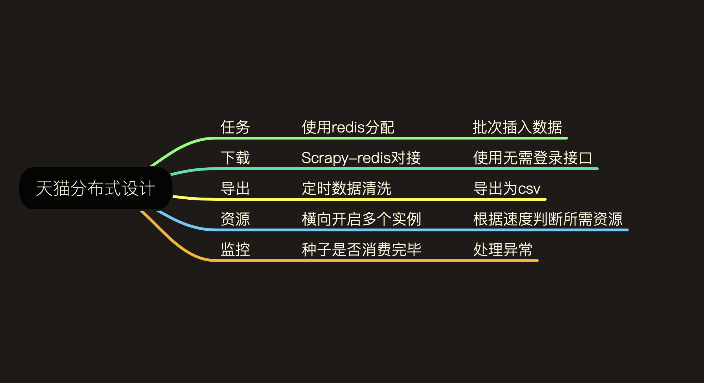

# tmall_chaoshi

## 爬虫设计

翻页抓取某分类下所有商品ID，PC端难点：

- 需要登录
- requests登录
- 浏览器驱动模拟登录
- 通过接口可以无需登录抓取

抓取某商品配送信息，提供商品ID即可，无需登录。

## 资源消耗

1. 测试爬虫。观察爬虫抓取速度，调整参数，达到抓大抓取效率
2. 得到平均每分钟下载速度，根据入库情况计算成功率
3. 计算资源消耗。根据目标来计算资源消耗。

## 分布式设计

